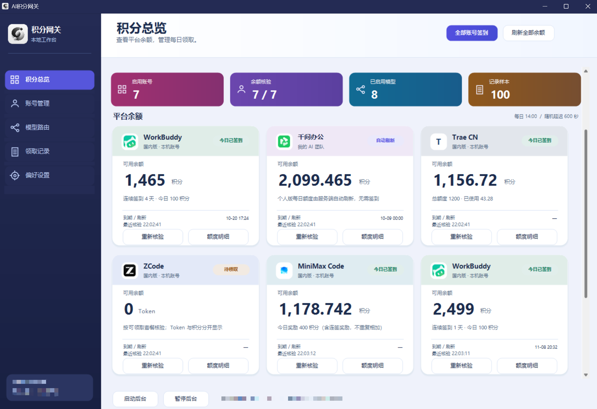

<h1 align="center">多 Agent 自动签到与 DSH 模型网关</h1>

<p align="center">
  <b>把多平台每日权益、账号余额和模型调用收拢到一个本地网关</b><br>
  WorkBuddy · Trae CN · 千问办公 · MiniMax Code · ZCode · 智谱 BigModel<br>
  多账号签到 · 积分耗尽切号 · OpenAI 兼容 API · SSE · 工具调用 · DSH bundle
</p>

<p align="center">
  <a href="package.json"></a>
  <a href="LICENSE"></a>
  
  
</p>

> **先看分发形式：本仓库发布后端源码、CLI、平台适配器、DSH 插件和部署脚本，不分发原生桌面 / Web 前端源码或桌面安装包。** 下方截图是本机已接入网关的原生桌面界面展示；克隆仓库后得到的是可运行的无界面服务，可以按管理 API 制作自己的前端。

## 界面展示



*用户提供的最新本机界面原图。图中的 7 个启用账号、8 条已启用模型、每日 14:00 设置及余额是截图时的个人配置，不是新部署默认值或额度承诺。WorkBuddy 多账号分别展示；积分、Token、现金与资源包保持各自单位。ZCode 的“待领取 / 0 Token”仅代表截图时状态。此图只用于展示，不附带前端实现。*

### 2026-10-09 更新

- **长会话 413 修复**：新配置的聊天请求体上限为 64 MiB；公共模型 API 和 DSH 私有 worker 一致读取当前配置。按 UTF-8 字节计数，保留完整消息及工具历史，不静默裁剪。
- **刷新已导入模型 = 刷新目录 + 真实体检**：管理接口支持 `scope: "imported"`，仅测试启用路由的实际目标，四阶段结果独立记录；其他模型的历史结果保留。
- **智谱官方接入**：API Key 用于官方模型调用及现金查询，控制台登录态用于资源包明细；这是平台官方适配器，不是第三方中转站。
- **103 + 2 项回归**：当前共 105 项测试，新增长历史、分块上传、限制热更新、限定模型体检、队列去重及官方智谱适配覆盖。

## 目录

- [项目简介](#项目简介)
- [核心能力](#核心能力)
- [平台支持与权益口径](#平台支持与权益口径)
- [工作原理](#工作原理)
- [快速开始](#快速开始)
- [账号与凭据配置](#账号与凭据配置)
- [定时签到与开机自启](#定时签到与开机自启)
- [WorkBuddy 多账号与积分耗尽切换](#workbuddy-多账号与积分耗尽切换)
- [模型发现、体检与导入](#模型发现体检与导入)
- [接入 DSH](#接入-dsh)
- [OpenAI 兼容调用示例](#openai-兼容调用示例)
- [管理 API 与自建前端](#管理-api-与自建前端)
- [目录与数据文件](#目录与数据文件)
- [常见问题](#常见问题)
- [验证与贡献](#验证与贡献)
- [参考项目与许可证](#参考项目与许可证)

## 项目简介

这个项目解决两件事：

1. **每日权益管理**：读取本机客户端登录态，按账号执行签到、检查每日免费额度或领取免费套餐，将结果写入 SQLite 账本。
2. **统一模型入口**：将各平台的模型协议映射为 OpenAI 兼容接口，让 DSH 等 Agent 工具通过统一入口调用。

账号凭据、模型上游和对外路由分层配置。签到和模型调用可以使用同一平台账号；一个账号可以绑定多个模型路由；WorkBuddy 可配置多个独立账号作为同模型备用池。

本项目不是 WorkBuddy2API Panel 的 fork。账号池和文档组织参考了该项目，但后端使用 Node.js，自有领取账本与统一输出层，实际代码复用范围见 [来源清单](THIRD_PARTY_NOTICES.md)。不将参考项目的 OAuth 面板、Redis、Docker 或成长任务自动化描述成本项目已经提供的功能。

## 核心能力

| 能力 | 当前实现 |
|---|---|
| 多平台每日权益 | WorkBuddy / Trae CN / MiniMax Code 签到，千问办公个人版每日额度检查，ZCode 免费套餐领取 |
| 多账号隔离 | `accounts` 列表，每个账号独立文件凭据与稳定身份绑定，不使用全局 token 单例 |
| WorkBuddy 账号池 | 同模型按配置顺序选择备用账号；积分耗尽时切号，成功账号保持使用，不做轮询 |
| 手动选择账号 | 管理 API 指定下一请求使用的账号；较早请求的完成结果不会覆盖新的手动选择 |
| 幂等领取账本 | 按账号身份、任务、日期去重；保留时间、结果、失败原因及平台回执 |
| 定时执行 | 启动检查、每日排程、随机延迟、失败重试间隔；后台存活时执行 |
| 模型目录 | 查询启用上游的模型，展示能力、已导入状态与体检结果；停用路由不对外发布 |
| OpenAI 兼容 | `GET /v1/models`、`POST /v1/chat/completions`，普通响应与 SSE 共用映射层 |
| Agent 工具调用 | 结构化 `tool_calls` 和工具结果回传；工具在 DSH / 调用方本地执行 |
| 图片与推理选项 | 根据上游声明映射能力；不统一虚构图片支持或推理强度档位 |
| 优先级 fallback | 按路由的 `targets` 顺序回退，结合 `fallbackStatuses`；已输出 SSE 后不重放整段请求 |
| 余额查询 | 单账号查询设截止时间，失败可返回缓存与 `stale` 标记，不把未知余额当作零 |
| DSH 插件 | bundle 注册 provider，经独立 Node worker 和随机端口 loopback shim 接入 |
| 自建前端 | 模型 API 与管理 API 分离，前端可采用 React、Vue、原生桌面或其他方案 |

第三方 API 中转站功能已移除；本仓库配置五类客户端平台及智谱官方 API 上游，不接受任意中转站 URL。活动任务不作为默认全自动功能，只有已实现的任务适配器才能执行。

## 平台支持与权益口径

| 平台 | 登录态来源 | 每日权益 | 模型适配与注意事项 |
|---|---|---|---|
| WorkBuddy 国内版 | 本机桌面端；多账号可保存独立快照 | Buddy 加油站每日签到，具体奖励以当次回执为准 | 复用 WorkBuddy bridge，模型按当前账号目录查询；快照过期需更新 |
| Trae 国内版 | IDE `storage.json` 及设备身份 | 每日签到；需要真实 `deviceId` | SOLO 通道适配；目录内模型可能不允许当前 function/config 调用 |
| Trae 国际版 | 对应国际版登录态与区域 | 订阅 / 权益检查，不按国内签到实现 | 可扩展区域配置；不承诺所有国际模型已实测 |
| 千问办公 QwenWork | 桌面个人版，切到“我的 AI 团队” | 每日额度由服务端自动重置，本项目查询核验 | 已实现模型协议适配；需本机编码器依赖，不是 Qwen Code CLI 或通义网页版 |
| MiniMax Code | 桌面登录态及原生 OAuth lease，或平台专用文件凭据 | 每日签到、奖励与余额查询 | 原生模型协议适配；与 MiniMax Agent 网页账号不是同一实现 |
| ZCode | 桌面登录态及设备上下文 | 免费套餐领取 / 查询；人工验证返回 `action_required` | 已实现模型适配；遇验证先在官方窗口完成，再重试 |
| 智谱 BigModel | 官方 API Key；资源包查询另需控制台登录态 | 查询现金余额、各资源包可用量与到期日；不执行签到 | 官方聊天 API；套餐按适用模型抵扣，Token / 次 / CNY 不合计 |

**适配器存在 ≠ 当前账号的所有模型都可用。** 上游权限、产品通道、套餐、地区、模型下线和验证状态都会影响结果。以自己的模型体检和实际调用回执为准，不发布固定的“全部平台全部模型永久可用”清单。

TraeCode CN 与 TraeWork CN 若对应同一身份和权益池，保留一个账号启用即可，不重复计算额度。

## 工作原理

```text
本机客户端登录态 / 账号隔离文件
             │
       CredentialManager ── 账号身份绑定、过期检查
             │
     ┌───────┴──────────────────────────┐
     │                                  │
签到 / 每日权益适配器              模型目录与路由
     │                                  │
SQLite 幂等账本                  平台 bridge / 原生协议
     │                                  │
管理 API / 记录查询              统一 OpenAI 响应 / SSE
                                        │
                         独立 HTTP 客户端 或 DSH bundle
                                        │
                              调用方执行本地工具
```

独立服务默认监听 `http://127.0.0.1:19421`。DSH bundle 的 worker 使用自己的随机端口 loopback shim 和进程内随机 secret；不把平台真实 token 交给下游模型选择器。两种入口共享配置与持久化账本，但不是同一个监听端口。

## 快速开始

### 运行环境

- **Node.js 24+**：使用内置 SQLite；先确认 `node --version`。
- **Git 与 npm**：用于克隆和构建，开发构建依赖为 esbuild。
- **Windows 优先**：自动读取登录态依赖对应客户端已安装、已登录。
- **Linux / macOS**：核心网关可运行；须自行配置该环境可用的凭据，不能直接照搬 Windows 加密登录目录。
- **DSH 按需安装**：独立 HTTP 服务不要求安装 DSH。

### Windows PowerShell

```powershell
git clone https://github.com/spdw666/multi-agent-checkin-dsh.git
cd multi-agent-checkin-dsh

# 安装依赖、构建模块、初始化配置；先不启动
powershell -NoProfile -ExecutionPolicy Bypass -File scripts/install.ps1 -NoStart

# 编辑本机配置，先启用已登录的平台
notepad config.local.json

node bin/ai-credit.mjs doctor
node bin/ai-credit.mjs start
Invoke-RestMethod http://127.0.0.1:19421/health
```

若账号已配置好，可以省略 `-NoStart`，脚本完成准备后直接启动后台。脚本不会替你登录平台，也不会安装截图里的原生界面。

### Linux / macOS

```bash
git clone https://github.com/spdw666/multi-agent-checkin-dsh.git
cd multi-agent-checkin-dsh
bash scripts/install.sh --no-start

# 编辑 config.local.json 和自己的账号凭据文件
node bin/ai-credit.mjs doctor
node bin/ai-credit.mjs start
curl http://127.0.0.1:19421/health
```

用 `node bin/ai-credit.mjs serve` 可前台运行，便于查看启动错误；`start` 则将日志追加到数据目录的 `service.log`。默认数据目录为 `./data`，相对于配置文件所在目录解析。

### 常用命令

```bash
node bin/ai-credit.mjs start
node bin/ai-credit.mjs stop
node bin/ai-credit.mjs doctor
node bin/ai-credit.mjs health --account workbuddy-main
node bin/ai-credit.mjs claim --all
node bin/ai-credit.mjs claim --account trae-code-cn --task daily-checkin
node bin/ai-credit.mjs models
node bin/ai-credit.mjs records
```

每条命令可追加 `--config /ABSOLUTE/PATH/config.local.json`，也可设置 `AI_CREDIT_CONFIG`。`doctor` 检查本机凭据形状 / 身份；`health` 再检查指定平台服务端状态，二者不是同一验证。

## 账号与凭据配置

`config.example.json` 是完整模板，初始化生成 `config.local.json`。示例仅默认启用 WorkBuddy 及一条路由，其他账号多为停用状态；新用户须自行启用，不能照截图推断全部五个平台已自动配置。

### 三层配置

```json
{
  "accounts": [{
    "id": "workbuddy-main",
    "platform": "workbuddy",
    "label": "WorkBuddy 主账号",
    "enabled": true,
    "credentials": {"kind": "desktop", "file": "auto", "executable": "auto"},
    "tasks": [{"id": "daily-checkin", "enabled": true}]
  }],
  "upstreams": [{
    "id": "workbuddy", "kind": "workbuddy",
    "accountId": "workbuddy-main", "enabled": true
  }],
  "routes": [{
    "id": "workbuddy/deepseek-v4.1-flash",
    "name": "WorkBuddy · DeepSeek V4.1 Flash",
    "enabled": true,
    "targets": [{"upstreamId": "workbuddy", "model": "deepseek-v4.1-flash"}]
  }]
}
```

此段只展示三层关系，**不是替代完整配置的独立文件**；模型 ID 需换成你的当前目录值。

- `accounts`：谁登录、凭据从哪里读取、启用哪些领取任务。
- `upstreams`：用哪个账号对接哪类模型协议。
- `routes`：对下游发布哪个模型 ID，映射到哪些上游目标。
- `enabled: false`：保留配置但停用；路由从 `/v1/models` 和 DSH 发布列表隐藏。

平台 token / Cookie 存在本机账号文件中，管理配置只保存引用。初始化时自动生成 `data/api-keys.json`：`apiKey` 用于模型调用，`adminKey` 用于管理操作，两者用途不同。

### 平台特别配置

| 平台 | 检查要点 |
|---|---|
| WorkBuddy | `credentials.file: auto` 复用当前桌面账号；保存多账号后改为各自文件引用；过期后重新登录并保存 |
| Trae | 选择正确 CN / 国际 / SOLO 登录目录；保留该设备真实身份；同权益账号避免重复启用 |
| QwenWork | 个人版“我的 AI 团队”；可设置 `personalTeamId`；Python 3.11+，安装 `vendor/qwen-requirements.txt`；设置 `QWENWORK_PYTHON` 与 `QWENWORK_WASM` 指向自己的解释器和客户端编码器文件 |
| MiniMax Code | 使用已登录的 MiniMax Code 桌面端；原生 lease 由客户端处理；网页 MiniMax Agent 的 Cookie 不等于此桌面登录态 |
| ZCode | 登录态、设备上下文和验证需匹配；验证窗口可通过 `AI_CREDIT_BROWSER` 指向自己的 Edge / Chromium |

```powershell
# 仅需千问模型协议编码器时配置；用你的实际路径
python -m pip install -r vendor/qwen-requirements.txt
$env:QWENWORK_PYTHON = 'C:\PATH\TO\python.exe'
$env:QWENWORK_WASM = 'C:\PATH\TO\your-client-encoder.wasm'
```

仓库不分发客户端程序或 WASM。Windows 环境变量要让启动后台 / DSH 的进程继承；设置后在正常的下一次启动加载，不要求重启整台电脑。

## 定时签到与开机自启

默认示例的定时配置如下，截图中的 14:00 是个人修改后的时间：

```json
{
  "enabled": true,
  "startup": true,
  "timezone": "Asia/Shanghai",
  "hour": 10,
  "minute": 0,
  "jitterSeconds": 600,
  "retryMinutes": 60
}
```

将此对象放入完整配置的 `scheduler` 字段。启动时检查一次，随后按每日时间加随机延迟执行；结果由幂等账本与服务端状态确认，重复检查不等于重复发放权益。

Windows 当前用户登录后自启：

```powershell
node bin/ai-credit.mjs install-autostart
# 取消
node bin/ai-credit.mjs uninstall-autostart
```

注册的是 `AiCreditGateway` 计划任务，使用当前用户交互登录、普通权限、`AtLogOn`。它启动**后台服务**，不是前端窗口；安装好并成功运行后，无需每天手动点击“启动后台”。注销 / 关机后不会继续执行，须在用户登录且后台可运行时检查。已有其他同名自启部署时先核对任务，避免覆盖不同配置的启动项。

Linux 可将前台命令交给自己的 systemd 服务管理：`/ABSOLUTE/PATH/node /ABSOLUTE/PATH/bin/ai-credit.mjs serve --config /ABSOLUTE/PATH/config.local.json`。仓库当前没有独立 Linux 自启安装器或 Docker 镜像，按部署环境编写服务配置，并让服务用户具有凭据目录读写权限。

## WorkBuddy 多账号与积分耗尽切换

### 保存不同账号

1. 在 WorkBuddy 客户端登录账号 A。
2. 用管理 API 调用 `POST /admin/workbuddy/capture` 保存为独立账号。
3. 在客户端切换到 B，再调用一次保存。
4. 用返回的账号 ID 配置池，不凭空编造客户端身份。

PowerShell 管理示例，密钥只从本机读取：

```powershell
$keys = Get-Content ./data/api-keys.json -Raw | ConvertFrom-Json
$admin = @{ Authorization = "Bearer $($keys.adminKey)" }
$base = 'http://127.0.0.1:19421'

# 客户端已登录 A 时调用；登录 B 后更换 id/label 再调用
$body = @{ id = 'wb-a'; label = 'WorkBuddy A' } | ConvertTo-Json
Invoke-RestMethod "$base/admin/workbuddy/capture" -Method Post `
  -Headers $admin -ContentType 'application/json' -Body $body
```

返回的是账号信息与本机文件引用，重复捕获同一真实身份会复用账号；别将响应路径下的凭据文件上传仓库。

### 配置同模型备用池

```powershell
$body = @{
  routeId = 'workbuddy/deepseek-v4.1-flash'
  accountIds = @('wb-a', 'wb-b')
  enabled = $true
  cooldownSeconds = 3600
} | ConvertTo-Json
Invoke-RestMethod "$base/admin/workbuddy/pool" -Method Post `
  -Headers $admin -ContentType 'application/json' -Body $body

Invoke-RestMethod "$base/admin/workbuddy/pools" -Headers $admin
```

`routeId` 必须是已存在的 WorkBuddy 路由；账号 ID 来自保存结果。使用同模型备用池，不用自动轮询消耗所有账号。

- 账号积分耗尽且尚未输出内容时，可尝试备用账号。
- `401`、参数错误和普通限流不直接当作积分耗尽。
- 已输出 SSE 内容后不会换号并从头重放，避免重复工具动作或重复回复。
- 明确刷新后余额恢复可让额度冷却账号恢复候选资格；普通限流有不同处理语义。
- 手动切换通过 `POST /admin/workbuddy/switch`，body 为 `{ "routeId": "路由ID", "accountId": "账号ID" }`，作用于后续请求，不中途迁移正在输出的请求。

所有启用账号可用 `node bin/ai-credit.mjs claim --all` 检查；账本按真实账号身份隔离，账号间使用有界并发。

## 模型发现、体检与导入

目录用于发现，体检用于验证，导入决定对外发布；三者不要混用。

```powershell
# 沿用上节的 $base / $admin
Invoke-RestMethod "$base/admin/model-directory?refresh=1" -Headers $admin

# 开始异步体检，随后读取进度和逐模型结果
Invoke-RestMethod "$base/admin/model-tests" -Method Post `
  -Headers $admin -ContentType 'application/json' -Body '{}'
Invoke-RestMethod "$base/admin/model-tests" -Headers $admin

# 导入一款你已核对的模型
$body = @{ items = @(@{
  upstreamId = 'workbuddy'
  model = 'deepseek-v4.1-flash'
  enabled = $true
}) } | ConvertTo-Json -Depth 6
Invoke-RestMethod "$base/admin/model-import" -Method Post `
  -Headers $admin -ContentType 'application/json' -Body $body
```

将同一条目改为 `enabled = $false` 可以取消发布对应单模型路由，保留配置。这里的模型 ID 只是示例；目录查询范围是**已启用上游**，不是所有停用配置。

体检包含普通响应、流式、工具调用与工具结果回传，会进行真实上游请求，可能消耗账号额度。结果如 `passed`、`failed`、`partial`、`uncertain`、`unavailable` 应连同原因查看；只有聊天通过不等于 Agent 工具链通过。不要把短暂超时写成模型永久下线。

## 接入 DSH

### 兼容与准备

本项目为 DSH bundle，不只是外部 HTTP 地址。相关 peers 范围为 `>=0.1.7-rc.1 <0.3.0-0`，本机接入基于 DSH Desktop / runtime `0.2.0-rc.2`，profile 为 `desktop`；不同版本仍需验证宿主契约。

**worker 使用独立 Node 24，不把 Electron / DSH 桌面可执行文件当作 Node。**

```powershell
$env:AI_CREDIT_NODE = (Get-Command node).Source
$config = (Resolve-Path ./config.local.json).Path
node scripts/install-dsh.mjs --config $config
```

安装脚本定位 Windows Desktop CLI，备份 profile 文件，添加 bundle，同步代码并写入配置路径。记录在 `data/dsh-install/`。脚本**不自动重启 DSH**；安装后在正常重启宿主时加载，不批量覆盖其他 provider 或默认模型。

其他 DSH 安装方式可按 [DSH 挂载说明](docs/dsh.md) 手动安装：

```bash
dsh plugin --profile desktop add file:/ABSOLUTE/PATH/multi-agent-checkin-dsh
```

检查 `~/.dsh/profiles/desktop/package.json` 的 `dsh.profile.bundles`，以及 `cordis.patch.yml` 中的插件配置：

```yaml
- id: dsh-ai-credit-gateway
  config:
    configFile: /ABSOLUTE/PATH/config.local.json
```

这是已有插件 ID 的配置 patch；bundle 自身带 `insert` 注册。已有同 ID 时修改配置，不重复插入。

### 模型接入流程

1. 先完成本地账号体检和模型目录查询。
2. 导入要发布的路由，停用不需要的模型。
3. 安装 bundle，使配置文件和独立 Node 路径可被 DSH 读取。
4. 初次安装后正常重启 DSH，在“AI 积分网关”provider 中选择模型。
5. 分别验证聊天、流式和工具调用；工具由 DSH 本地执行。

运行中的目录刷新与宿主首次加载不是同一回事。遇初始化崩溃先看 worker / 宿主日志，不反复重启整台电脑。

## OpenAI 兼容调用示例

### PowerShell：模型列表与普通聊天

```powershell
$keys = Get-Content ./data/api-keys.json -Raw | ConvertFrom-Json
$headers = @{ Authorization = "Bearer $($keys.apiKey)" }
$base = 'http://127.0.0.1:19421'

$models = Invoke-RestMethod "$base/v1/models" -Headers $headers
$models.data | Select-Object id

# 使用网关返回的路由ID，不直接填写猜测的上游名称
$body = @{
  model = $models.data[0].id
  stream = $false
  messages = @(@{ role = 'user'; content = '你好，请简短介绍自己。' })
} | ConvertTo-Json -Depth 8
Invoke-RestMethod "$base/v1/chat/completions" -Method Post `
  -Headers $headers -ContentType 'application/json' -Body $body
```

### Shell：SSE 流式

`API_KEY` 从本机密钥文件读入环境；`MODEL_ID` 从 `/v1/models` 选取：

```bash
export API_KEY="$(node -e "console.log(JSON.parse(require('fs').readFileSync('data/api-keys.json')).apiKey)")"
export MODEL_ID='workbuddy/deepseek-v4.1-flash'
curl -N http://127.0.0.1:19421/v1/chat/completions \
  -H "Authorization: Bearer $API_KEY" \
  -H 'Content-Type: application/json' \
  -d "{\"model\":\"$MODEL_ID\",\"stream\":true,\"messages\":[{\"role\":\"user\",\"content\":\"你好\"}]}"
```

响应为 `data: {...}` SSE 分块，正常结束以 `data: [DONE]` 标记；客户端需支持流式读取。

### 工具定义与结果回传

请求体可以加入标准工具定义：

```json
{
  "tools": [{
    "type": "function",
    "function": {
      "name": "get_weather",
      "description": "查询指定城市天气",
      "parameters": {
        "type": "object",
        "properties": {"city": {"type": "string"}},
        "required": ["city"]
      }
    }
  }]
}
```

上游返回 `tool_calls` 后，调用方执行工具，再将带相同 `tool_call_id` 的 `role: "tool"` 消息和原 assistant 工具调用消息一起回传。网关只负责协议映射，不替调用方执行任意函数。图片输入、推理强度选项也以该模型的真实能力为准。

## 管理 API 与自建前端

模型接口使用 `apiKey`，所有 `/admin/*` 操作用 `adminKey` 的 Bearer 认证。浏览器自建 UI 需保持同源或经自己的后端代理；不同 Origin 的直接管理请求会被拒绝。

| 方法 | 路径 | 用途 |
|---|---|---|
| GET | `/health` | 服务健康检查 |
| GET / PUT | `/admin/config` | 读取 / 保存完整管理配置，不内联凭据 |
| POST | `/admin/doctor` | 本机登录态检查 |
| POST | `/admin/health` | 指定 `accountId` 的平台服务端体检 |
| POST | `/admin/claim` | `{}` 检查全部账号；或 `{accountId, taskId}` |
| GET | `/admin/balances?refresh=1` | 明确刷新余额；查看错误与 `stale` |
| GET | `/admin/records?limit=100` | 查询领取记录，可加账号 / 平台过滤 |
| GET | `/admin/model-directory` | 模型目录、能力、导入与检测状态 |
| GET / POST | `/admin/model-tests` | 查询 / 开始异步模型体检 |
| POST | `/admin/model-import` | 导入或停用选中的模型条目 |
| POST | `/admin/workbuddy/capture` | 保存当前客户端账号 |
| GET | `/admin/workbuddy/pools` | 查看账号池状态 |
| POST | `/admin/workbuddy/pool` | 配置同模型备用账号池 |
| POST | `/admin/workbuddy/switch` | 手动选择下一请求账号 |
| POST | `/admin/shutdown` | 停止独立后台 |

当前体检实现使用 **`/admin/model-tests`**；以 `src/server.mjs` 为接口事实源。管理契约详见 [docs/api.md](docs/api.md)。

### 刷新并测试已导入模型

```powershell
$keys = Get-Content ./data/api-keys.json -Raw | ConvertFrom-Json
$admin = @{ Authorization = "Bearer $($keys.adminKey)" }
Invoke-RestMethod 'http://127.0.0.1:19421/admin/model-tests' -Method Post `
  -Headers $admin -ContentType 'application/json' -Body '{"scope":"imported"}'
# POST 返回 202 后在后台运行，不等于测试已经通过。
Invoke-RestMethod 'http://127.0.0.1:19421/admin/model-tests' -Headers $admin
```

`scope` 默认为 `all`；`imported` 从已启用路由提取实际目标，包含备用目标和 WorkBuddy 账号池成员，同一上游同一模型只测试一次。刷新相关上游目录后，依次测试普通文本、完整 SSE、结构化工具调用、工具结果回传。缺失模型不替换成别的模型，目录失败保留原目标并给出原因。

本轮涉及的模型立即标为 `running`，不拿旧的通过结果当新结果；不涉及的历史记录及 `finishedAt` 保留。读取 `scope / status / completed / total / summary / results / jobKeys` 展示本轮状态，`results` 可含历史条目，因此不要用其总长度计算本轮进度。同范围重复请求复用当前任务；不同范围通过 `queuedScope` 表示排队，当前任务结束后自动开始，不并发创建重复体检。

`passed` 表示四项通过；`partial` 表示聊天通过但工具链未全部通过；`uncertain` 表示超时等待复测；`unavailable` 表示当前目录或通道不提供；错误和时间戳应展示在自建 UI。体检会实际消耗平台额度，不改变导入选择或账号池偏好。

### 智谱官方模型与资源包

完整配置例子与字段说明见 [docs/bigmodel.md](docs/bigmodel.md)。官方 API Key 和控制台登录态存入账号专属的本机文件，不填写到管理配置里。API Key 可调用模型；资源包列表需要控制台登录态，二者用途分开。

资源包适用模型、单位、状态及到期日以控制台返回为准。GLM 文本/图片输入适配不等于已支持图像生成、视频生成或搜索任务。响应成功也不直接证明某个特定资源包已抵扣，需比较平台账单和余额更新时间。

做 UI 时应保留结果与错误原因：HTTP 200 不等于权益发放成功；每项 `status / reason / credits` 才是结果。请求结束在 `finally` 释放忙碌状态，不让“正在处理”永久占据界面。余额读取失败展示缓存时间与失败原因，不把缺数据显示为零。

## 目录与数据文件

```text
bin/                      CLI 入口
src/                      配置、凭据、平台适配、账本、路由、HTTP、调度
bundle/                   DSH provider 与独立 worker
vendor/                   复用模块、构建输入及其完整许可证
scripts/                  构建、Windows/Linux准备、DSH安装、自启
tests/                    回归与模拟上游测试
docs/                     管理契约、DSH说明及展示图片
config.example.json       无凭据配置模板
config.local.json         初始化生成的本机配置（不入Git）
data/                     运行数据（不入Git）
  api-keys.json           模型key / 管理key
  runtime.json            独立后台PID与地址
  service.log             启动与后台日志
  accounts/               按账号隔离的本机快照
  dsh-install/            profile安装备份与记录
```

以你的 `dataDir` 为实际位置。仓库不包含运行 key、Cookie、token、账号快照、账本数据库、个人配置、客户端 exe 或 WASM；界面展示 PNG 是文档资产，不是前端程序。

## 常见问题

<details>
<summary><b>同一模型新会话正常，老会话报 413 / body_too_large？</b></summary>

先区分字节限制与模型上下文限制：老会话携带的历史消息、工具定义、工具结果或图片会增加 HTTP 请求体。旧配置的 4 MiB 上限可在请求到达模型前返回 413，新会话较短则成功，这不是模型突然下线。

新部署 `server.bodyLimitBytes` 默认 `67108864`（64 MiB）。旧部署请在本机配置中调整该字段；允许范围是 1024–67108864 的整数字节。管理请求仍维持 4 MiB，不同步扩大。已加载旧程序代码需一次正常重启网关/DSH 插件进程；使用新代码后该限制按请求读取，DSH worker 每 30 秒载入配置变化。

网关不静默删除历史。超过新的字节上限仍返回 413，错误包含当前字节数及上限；如果上游另报 context length / token limit，应由 DSH 的上下文压缩机制处理，这是另一层限制。增大传输上限不会增大模型实际上下文窗口。

</details>

<details>
<summary><b>为什么打开首页没有管理面板？截图里的 UI 怎么安装？</b></summary>

这是无界面源码分发，根路径返回服务信息。截图展示本机独立开发的原生界面，仓库没有其源码或安装包。可直接使用 CLI / 管理 API，也可自行做前端。`ai-credit ui` 不会安装或打开一个随包面板。

</details>

<details>
<summary><b>启动成功，为什么签到没成功？</b></summary>

检查账号是否启用、任务是否启用、客户端登录是否有效、日志中的具体原因。千问个人额度是自动刷新，不需要手动签到；ZCode 可要求人工验证；Trae 临时拥堵可重试。`already` 表示已签到 / 已领取，不是再次发放。批量命令的退出码也不能替代逐账号结果检查。

</details>

<details>
<summary><b>为什么模型目录很多，DSH 里只有几款？</b></summary>

目录发现和导入发布分离；只发布已启用路由。先查看 `/admin/model-directory`，体检后通过 `/admin/model-import` 选择导入。初次加载 bundle 需正常重启 DSH；不要把停用模型重新自动导入。

</details>

<details>
<summary><b>为什么某些 Trae 模型报 config_name / 4001 错误？</b></summary>

模型出现在目录中，不代表当前账号的 SOLO function 可以调用它。查看体检中的 unavailable / reason；核对产品通道及对应模型，停用当前通道不提供的条目。反复重试同一个参数错误不会获得权限。

</details>

<details>
<summary><b>千问报 encoder failed 或 INVALID_TOKEN 怎么处理？</b></summary>

先检查 `QWENWORK_PYTHON`、Python依赖和自有 `QWENWORK_WASM` 路径；编码器缺失与登录 token 过期是不同故障。重新登录客户端，确认“我的 AI 团队”个人版，再做 doctor / health / 模型体检。不要用通义网页或 Qwen Code CLI 登录态替代。

</details>

<details>
<summary><b>余额为零、余额未知、缓存余额有什么区别？</b></summary>

零是平台明确返回的数值；未知是没有可用结果；缓存余额带旧核验时间和 `stale`。积分、Token 和免费额度单位不同，不能相加成跨平台总余额。HTTP请求成功也可能包含平台业务错误。

</details>

<details>
<summary><b>我切换了客户端账号，为什么提示 principal_changed？</b></summary>

网关绑定账号 ID 与稳定身份，防止同一个配置意外消耗另一个账号。新账号用保存 / 新增流程创建独立记录；明确要重新绑定现有账号时调用 `/admin/rebind` 并核对身份，不直接覆盖多个账号的同一凭据文件。

</details>

<details>
<summary><b>能搬到 Linux VPS 吗？</b></summary>

核心服务可以运行，但自动读取的 Windows 加密登录态、原生 MiniMax lease、浏览器验证和千问编码器不自动迁移。先在目标环境准备可用凭据与平台依赖，再验证每条链路。默认只监听 loopback；改变监听地址时要同时调整 `host / allowRemote` 并管理网络入口。

</details>

## 验证与贡献

```bash
npm ci
npm run check
```

当前回归集包含 **105 项测试**，覆盖普通 / SSE / 工具调用、工具结果回传、跨进程幂等、账号池、手动切换竞争、临时拒绝恢复、余额查询超时、官方智谱适配、超过 4 MiB 的完整历史和已导入模型限定体检。离线回归使用模拟上游，不能由此推断每个真实账号 / 地区 / 模型已经通过。真实验证由部署者用自己的登录态执行并记录。

反馈问题时提供平台、客户端版本、路由 ID、错误码、普通或流式、工具调用阶段及去除秘密的日志。不要提交 token、Cookie、运行密钥、账号快照或个人数据库。

贡献代码前确认测试通过；新增平台能力说明清楚“目录声明 / 模拟测试 / 真实调用”三类证据。修改接口或任务行为时同步配置示例和文档。

## 参考项目与许可证

原创实现采用 [MIT](LICENSE)。第三方模块保留各自版权头、完整许可证和来源，详见 [THIRD_PARTY_NOTICES.md](THIRD_PARTY_NOTICES.md) 与 `vendor/`，下面区分代码复用和设计 / 协议参考：

| 项目 | 使用方式 |
|---|---|
| [dingminhua/dsh-connect-workbuddy](https://github.com/dingminhua/dsh-connect-workbuddy) | 复用 WorkBuddy 上游 bridge 与 DSML 相关模块，保留 MIT 与来源记录 |
| [dingminhua/dsh-connect-trae](https://github.com/dingminhua/dsh-connect-trae) | 复用设备身份、目录、区域、SOLO bridge、签到相关模块；统一输出层由本网关实现 |
| [hawklithm/workbuddy2api](https://github.com/hawklithm/workbuddy2api) | 上述 WorkBuddy DSML 模块的移植来源，随上游 notices 保留 |
| [spirodelazz/ide-daily-checkin](https://github.com/spirodelazz/ide-daily-checkin) / [88lin/workbuddy-auto-signin](https://github.com/88lin/workbuddy-auto-signin) | 复用 WorkBuddy 凭据读取助手，不执行其成长任务或抽奖流程 |
| [TriDefender/zcode-api](https://github.com/TriDefender/zcode-api) | 复用三个上下文模块；其 README 声明 MIT，具体提交及改动在 `vendor/zcode-context/NOTICE.md` |
| [wicm84266964/Buddy2api](https://github.com/wicm84266964/Buddy2api) | 千问协议助手参照，完整许可证随 `vendor/qwenwork_ref/` 保留 |
| [linguo2625469/workbuddy2api-panel](https://github.com/linguo2625469/workbuddy2api-panel) | 参考账号池、耗尽与限流分类、冷却恢复及本 README 的信息组织；未移植 Go 服务、Web UI 或自动成长任务 |
| [wangmingdong/workbuddy-signin](https://github.com/wangmingdong/workbuddy-signin) | 参考 MiniMax 签到协议与界面信息组织，本网关独立实现 Node 适配 |
| [Shuffle-1992/TraeSign](https://github.com/Shuffle-1992/TraeSign) | 参考 ZCode 登录态形状与官方验证流程 |
| [MiniMax-AI/minimax-code](https://github.com/MiniMax-AI/minimax-code) | 参照官方模型目录、Mavis Messages 与 Matrix 余额协议，独立实现 OpenAI 映射 |
| [deepseek-ai/deepseek-harness](https://github.com/deepseek-ai/deepseek-harness) | 对照 DSH bundle / provider / PiAiAdapter 宿主契约 |

感谢上述项目作者与贡献者。这里借鉴功能分组、部署步骤和 FAQ 的文档结构，不复制其他项目的功能承诺；上游代码、平台服务与本项目分别维护，具体功能以本仓库实现和实际回执为准。
